# 游戏AI系统

本篇学习主要参考了[给猫看的游戏AI实战](https://zhuanlan.zhihu.com/p/28654527),感谢原文大大的创作！


## AI行为综述

- **可能性图**:目前所以可以做的行为
- **认知**:AI视觉，听觉
- **决策**:具体行动执行，寻路等等
- **环境**:推箱子，触发机关等等
- **群体交互**:多个AI进行的动作（FIFA,2K）


## 模拟视觉系统

### 原理

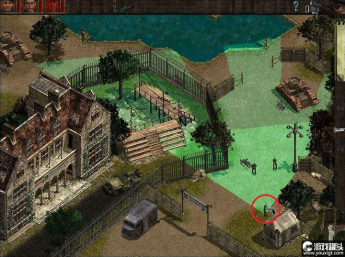

图中士兵为AI本身，绿色区域就是他的可见区域，即视觉系统。

### 实现

主要思路是通过**射线检测**

我们首先设置射线的长度，以及射线旋转的角度，物体正面的-45度到45度，共30根射线。

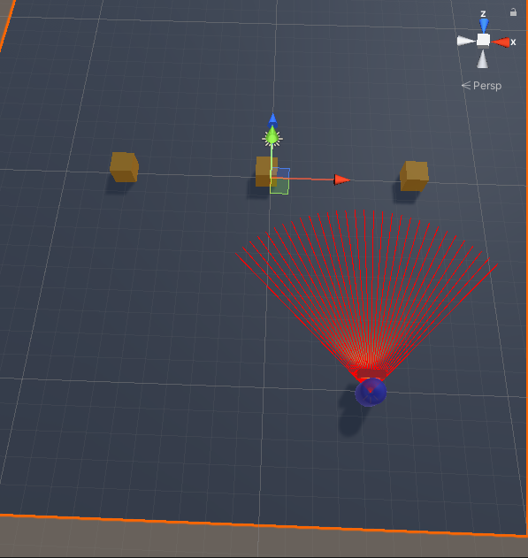

```c#
//射线长度
public float viewRadius = 8.0f;
//射线数量
public float viewAngleStep = 30;

//定义最左边的射线
Vector3 forward_left = Quaternion.Euler(0, -45, 0) * transform.forward * viewRadius;
for(int i=0;i<=viewAngleStep;i++){
	//30根线在90度中平分，每根线旋转3度
	Vector3 v = Quaternion.Euler(0,(90.0f/viewAngleStep)*i,0) * forward_left;
	//创建射线（起点是物体本身，终点是刚才定义Vecotr3位置）
	Ray ray = new Ray(transform.position,v);
	RaycastHit hit;
	//处理射线检测
	if(Physics.Raycast(ray,out hit,viewRadius,mask)){
	      ...
	}
}
```

### 进阶

当射线检测到敌人时显示10帧，若未检测到便隐藏meshRender。

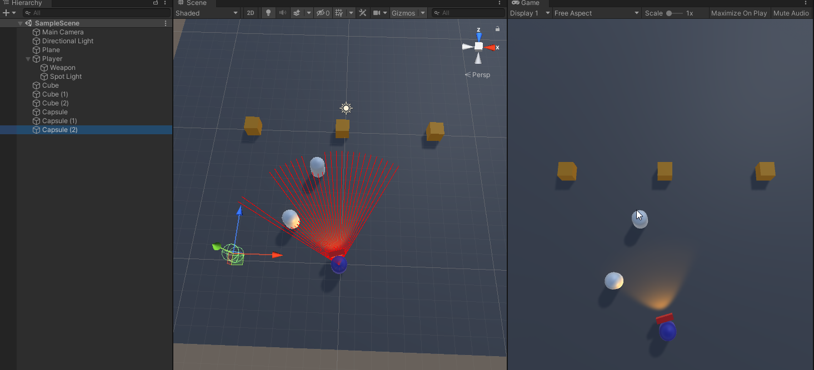

```C#
//我们在射线检测中进行判断并修改spottedFrame为当前的Time.frameCount
if (spottedFrame >= Time.frameCount - 10){
    meshRenderer.enabled = true;
}else {
    meshRenderer.enabled = false;
}
```

射线检测的物件指定我们可以通过修改Layer层来实现。

```c#
int mask = LayerMask.GetMask("enemy", "obstacle");
```


## 状态机

### 概念

有限状态机是长久以来AI编程最基本的方法，我们可以理解状态机是一种简化的可能性图。

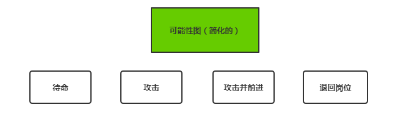

**例**:我们现在认为玩家是敌人。

1. 玩家未出现在视野中，AI选择待命
2. 玩家出现在视野中，AI进行攻击
3. 玩家逃跑，AI进行追击（攻击并前进）
4. 距离过远，退回岗位，继续待命

我们理解在不同状态下AI能选择的行为是受限制的，AI只能在有限行为中选择合适的，这就是可能性图。

### 实现

首先我们需要根据上方的视觉模拟代码给予AI视觉模拟，用于发现玩家。然后我们先设计AI的可能性图。

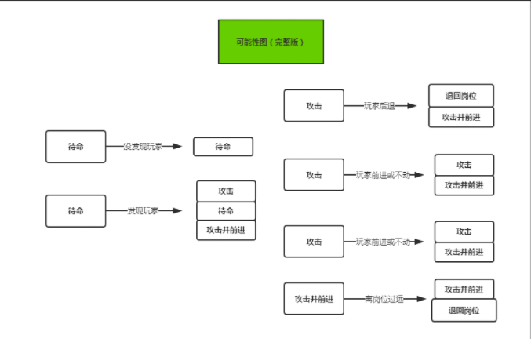

通过可能性图我们需要得到一个简化版本的状态，也就是状态转移设计图，即状态机图。

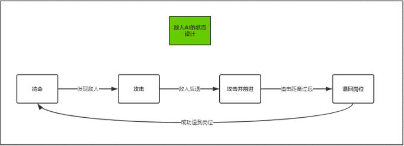

我们开始使用代码来描述上述状态机。

```c#
public enum State{
	Idle,   //待命
	Attack, //攻击（攻击并前进是攻击的子状态，不单独归为一类）
	Back,	//后退
}
public State state;
void Start(){
    state = State.Idle;//初始状态为Idle
}

void Update(){
   if(射线检测为玩家){
       state = State.Attack;
   }
}

//状态机处理逻辑
void StateHandle(){
    if(state == State.Idle){
        ...   //保证模型原始的位置与转向
    }else if(state == State.Attack){
        if(敌人离得太远，或者离开初始过远){
            state = State.Back; //转换状态为Back
        }else{
            ... //转向敌人并攻击
        }
    }else if(state == State.Back){
        if(当前位置已到初始位置){
            state = State.Idle; //转换状态为Idle
        }
        ... //不断后退
    }
}
```


## AI协作

AI之间协作的最主要的点在于**AI之间的通信机制**，这里我用搬箱子的例子做一个简单的说明（这里AI的主要触发机制仍然使用的是**状态机**）。

### 单个AI的实现

现在我们先来实现一个简单的单个AI的搬箱子系统，目的是将散乱的箱子搬到正确的位置，效果如下。

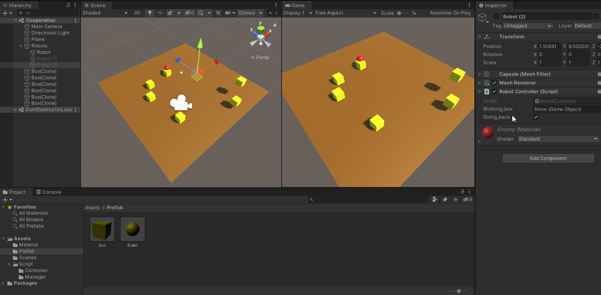

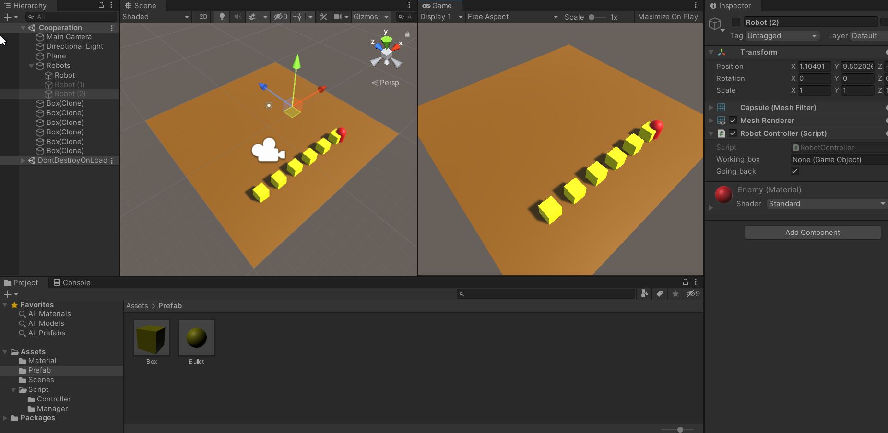

首先我们需要定义一个**BoxManager类型**，用于定义：

- 按下鼠标左键在指定ground上空生成Box
- 将每一个Box对象信息存入List以及Dictionary中
- 根据每一个Box的键值对，依据行列排序给出每一个Box最终的坐标

```C#
public Dictionary<GameObject, int> boxes = new Dictionary<GameObject, int>();
public List<GameObject> boxlist = new List<GameObject>();
private int current_id = 1;

private void BoxGenerate()
{
    Ray ray = Camera.main.ScreenPointToRay(Input.mousePosition);
    RaycastHit hit;
    if (Physics.Raycast(ray, out hit,LayerMask.GetMask("Ground"))) {
        GameObject box = Instantiate(box_prefab, new Vector3(hit.point.x, 5, hit.point.z),Quaternion.identity);
        boxlist.Add(box);
    }
}

public Vector3 BoxCleanPos(int id) {
    int col = (id-1) % 6;
    int row = (id - 1) / 6;
    Vector3 v = new Vector3(-6.0f + col * 2.0f,0.5f,-6.0f + row*2.0f);
    return v;
}
```

然后我们声明一个RobotController类型，他控制搬运机器人的状态，主要定义：

- 有箱子等待搬运
  - 跑向该箱子
  - 搬运箱子
- 没有箱子
  - 寻找箱子

我们通过working_box与going_back两个成员变量来控制整个搬运机器人的状态机。

```c#
private void UpdateStateMachine() {
  //如果当前没有正在搬运的货物，则从box中查找需要搬运的货物
  if (working_box == null) {
      foreach (var item in BoxManager.instance.boxes)
      {
		... // 找到一个需要搬运的货物，设置为当前正在搬的
      }
  }

  //如果当前正在搬运货物
  if (working_box != null) {
      if (going_back == false)
      {
          if (CleanBox(working_box))//箱子搬运完成
          {
              working_box = null;
              going_back = true;
          }
      }else{
      		if(正在跑向货物){
      			... //跑向货物
      		}else{
      			going_back = false;
      		}
      }
  }
}
```

### 多个AI的协作

**多AI的协作方式十分类似操作系统中信号互斥的概念，我们通过对当前的box加锁解锁来保证一个box只能由一个Robot对象进行处理，只有在完成搬运后才进行解锁。**

```c#
    //加锁
    public bool LockBox(GameObject box,GameObject robot) {
        BoxData boxData = box.GetComponent<BoxData>();
        if (boxData == null) {
            return false;
        }
        if (boxData.working_robot == null) 
        {
            boxData.working_robot = robot;
        }
        if (boxData.working_robot != robot)
        {
            return false;
        }
        return true;
    }
    
    //解锁
    public bool FreeBoxLock(GameObject box, GameObject robot) {
        BoxData d = box.GetComponent<BoxData>();
        if (d == null)
        {
            return false;
        }
        if (d.working_robot == null)
        {
            return true;
        }
        if (d.working_robot != robot)
        {
            return false;
        }
        d.working_robot = null;
        return true;
    }
```

那我们只需要在寻找搬运箱子之前进行临界区加锁的判断，以及在完成后解锁既可完成多个AI的协作了。

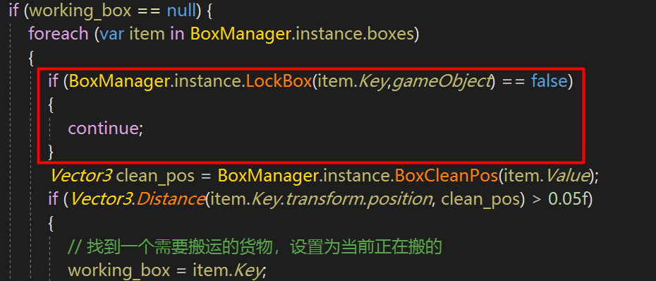

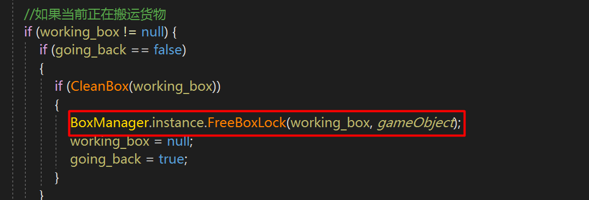


## 行为树（Behavior Tree）

### 概念

- 状态机是以多个状态为核心，以状态转移为线索的一种图表
- 行为树是以行为逻辑为框架，以具体行动作为节点的一种树状图

**举个例子**:我们现在有以下需求：

1. 敌人发现玩家进攻
2. 进攻时瞄准敌人射击，并跑向敌人
3. 离初始位置过远或与玩家的相对距离过远，停止追击，回到初始位置
4. 被远距离狙击时，跑到掩体内并待机

这一些内容在**状态机的可能性图**下会非常复杂，如下图所示。

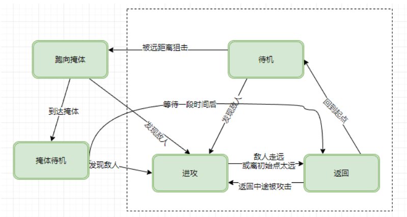

而我们可以看一下**行为树的表示**。

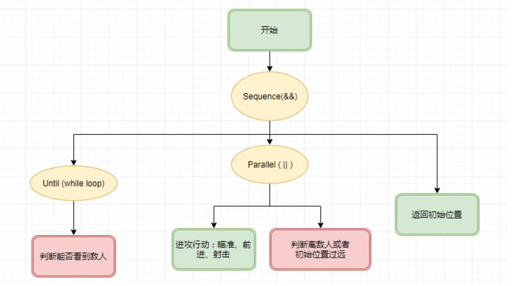

其中**黄色节点可以判断为循环(while)，并行(parallel)等等，红色节点做if else的判断，而绿色节点来实现真正的行为（Action）**。

### 行为树插件（Behavior Designer）

行为树中的节点，会在某一帧被调用并返回一个结果：**成功Success，失败Failure，运行中Running**，只能取三者其一，组合器和修饰器会根据返回值进行下一步，这便是行为树的基本逻辑。

**节点并不是多线程并行的**，被调用的节点迅速执行完毕并返回Running、Success、Failure。**所有事件总是有先后之分的**。

#### 组合器

1. **Sequence串行AND**：类似&&，从左到右每帧执行**一个子节点**。
   - 子节点success执行下一个；
   - 子节点failure，Sequence也失败；
   - 子节点Running，继续执行该子节点；
2. **Selector串行OR**：类似||,从左到右每帧执行**一个子节点**。
   - 子节点success，Selector返回成功；
   - 子节点failure，执行下一个子节点；
   - 子节点Running，继续执行该子节点；
3. **Parallel并行的AND**：类似&&，每帧执行**所有子节点**。
   - 所有节点Running，Parallel返回Running
   - 任何一个节点failure，Parallel直接失败
   - 任何一个节点成功，下一帧这个节点不执行，所有节点success，Parallel成功
4. **Parallel Selector并行的OR**：类似||，每帧执行**所有子节点**
   - 所有节点Running，Parallel Selector返回Running
   - 任何一个节点failure，Parallel Selector继续Running，直到所有节点失败，Parallel Selector也failure
   - 任何一个节点成功，Parallel Selector成功

在插件中的图示如下所示：

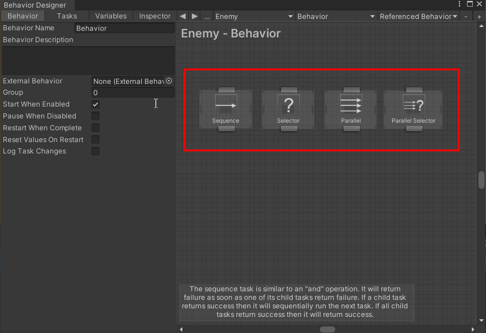

#### 修饰器

1. **Inverter**：条件判断或动作的返回结果取反，成功变失败，失败变成功，Running不变。
2. **Reapter**：循环执行，可以调节循环次数等参数。
3. **Return Failure**：返回值无论成功或失败都返回失败，但Running还是Running。
4. **Return Success**：同上，相反。
5. **Until Failure**：循环直到失败，换句话说如果成功就再次执行子节点。
6. **Until Success**：同上，相反。

#### 变量保存

当使用插件时，我们可以将变量保存在SharedTransform这种组件下，当然我们也可以用数据系统，实例化对象或者用DataManager进行管理，行为树脚本可以去获取当前组件下的一些内容，如下：

```c#
public class FireAction : Action
{
    // The transform that the object is moving towards
    CharacterData chaData;

    public override void OnAwake()
    {
        chaData = gameObject.GetComponent<CharacterData>();
    }
}
```

### 行为树实战

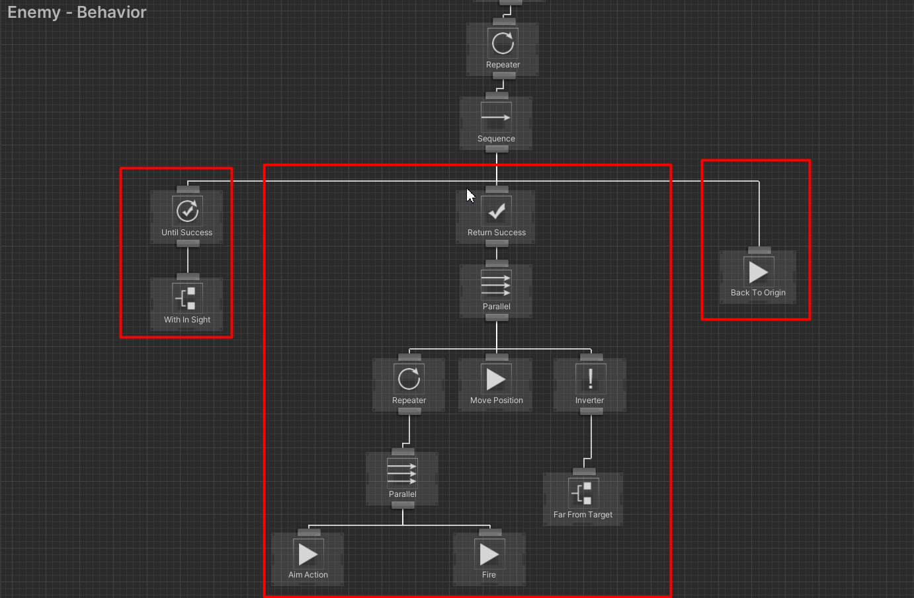

整块行为树由三部分组成，这里我们的做法和状态机是很类似的，但实际上我们可以看到我们主要开始用conditional，Action，以及composition进行组合来得到一个敌人的行为，且我们可以自定义自己的行为脚本，使得我们大部分的通用脚本可以复用，比如视野模拟：WithInSight，开火Fire，转向目标瞄准AimAction，移动到指定区域MoveTowards。

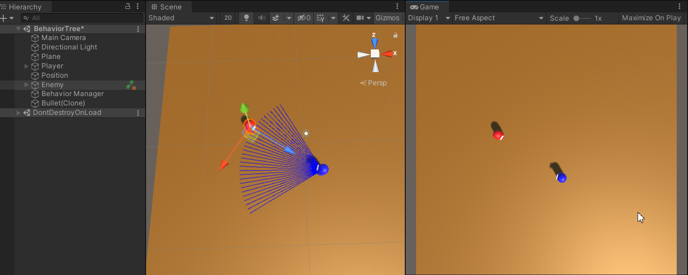

我们仍然可以得到与原状态机类似的效果。

此外需要提到的是行为树脚本中的Global，Shared变量

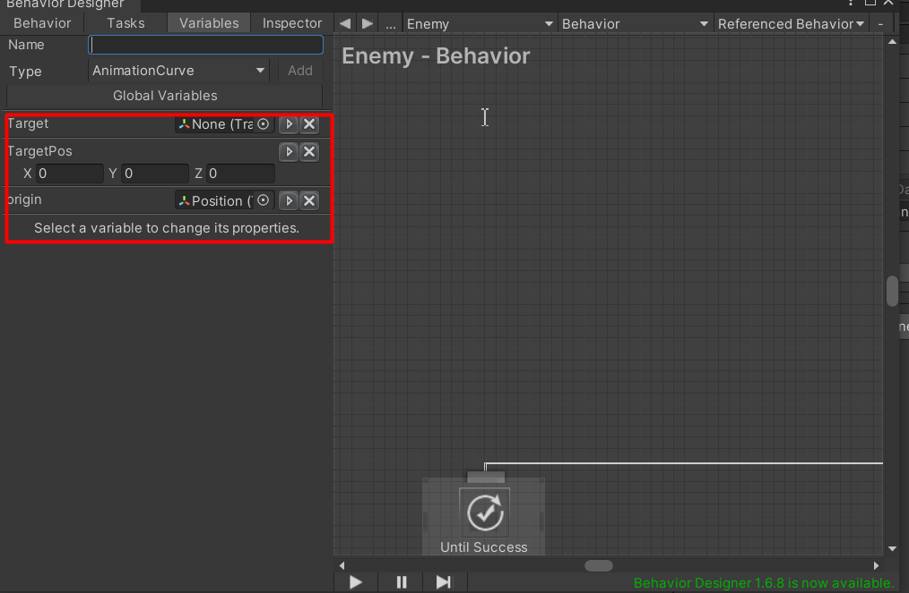

我们可以通过设置这些变量让我们在某一个gameobject的行为树上所有脚本都可以分享这些向量，亦或者在任意行为树上使用。这主要与工程相关，同样这些**内容可以以持久化的方式**进行保存。
